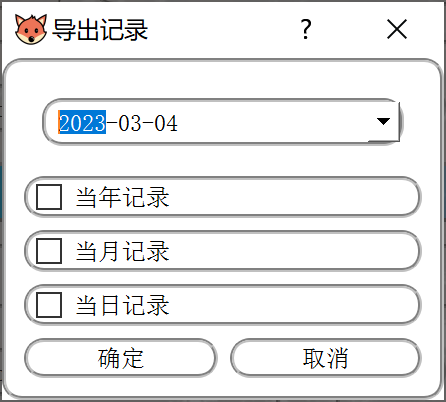

# DeskTip
## Catalog
- [1\. Introduction](/README.md/#Introduction)
- [2\. Code-Structure](/README.md/#Code-Structure)
- [3\. Package](/README.md/#Package)
- [4\. Requirment](/README.md/#Requirment)
- [5\. Versions](/README.md/#Versions)

## Introduction

### In a Word

This is a small desktop which can help with daily scheduled，styled **Four-quadrant table**

### Why is "Four-quadrant table"?

[The Priority Quadrant: Manage Tasks Using the 4-Quadrant Method (appfluence.com)](https://appfluence.com/productivity/why-you-should-manage-tasks-using-the-4-quadrants-method/)

### What can you do with "DeskTip"?

1. You can fill in the daily schedule in different quadrant，includes text and url

   

2. You can finish the items[1]、edit the items[2]、jump to the item[3]、delete the item[4]  at the related position(Notice: every time after modify,you should click the "修改后同步" to sync the database (⊙﹏⊙))

   

3. You can export the records and supervise yourself（feedback for your mission complementation situation）

   

4. The schedule will stick on you desktop，you can drag it or place it in different layer（right click）

   

5. You can edit the percent of non-transparency by right click（100% to 50%）

   

6. You can fold it into a circle and see the percent of  mission complementation situation

   

7. It can **automatically popup every day** once you add "DeskTip.exe" into the auto-process app in you pc

- （1）win + r 
- （2）shell:startup
- （3）copy the DeskTip.exe shortcut in the directory

### How to install？

- If you only want to use,you can download the release exe，and follow the install steps

  

- Before you use,make sure you have a suitable environment

  - mysql (>=8.0 is better) 

  - windows

## Code-Structure

**/deskTip**：main code of this app 

- DAO：database connect layer
- dialogs：define some popup dialog 
- entity：pojo
- service：the layer between user and DAO
- widgets：some customized widget
- CircleTip：circle status of app（folded）
- DeskTip：unfold status of app
- Main.py：entrance of app

**/adminInfo**：the code help with mysql register and connection

- InfoDialog.py：a dialog required mysql info

## Package

detailed package step：

- “.spec” files are provided，you should edit somewhat based on your local environment
- refer to [Using PyInstaller — PyInstaller 5.4.1 documentation](https://pyinstaller.org/en/stable/usage.html#how-to-generate)

## Requirement

- python>=3.8
- pyinstaller==5.4.1
- PyMySQL==1.0.2
- PyQt5==5.15.7
- PyQt5-Qt5==5.15.2
- PyQt5-sip==12.11.0

## Versions

> The code in this repo belongs to v1.4

### V1.0 

   

### V1.1

- [x]  fix Mysql version problem

### V1.2 

- [x] transparency

- [x] able to hide the side of window

- [x] right click menu

  

### V1.3

- [x] upper layer problem
- [x] simple color

  

### V1.4 

- [x] fold button

  

- [x] circle mode with percent

  

